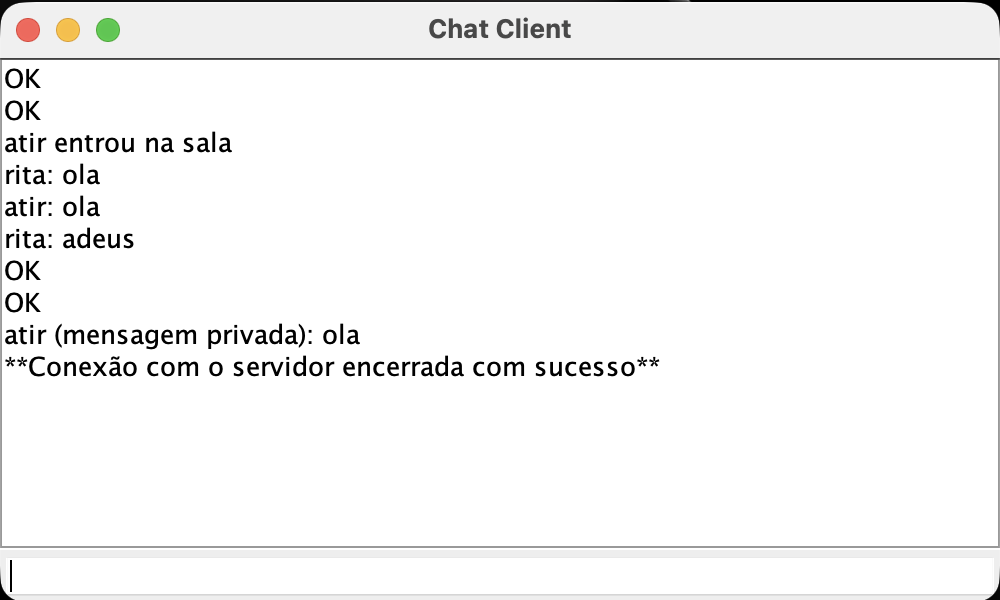
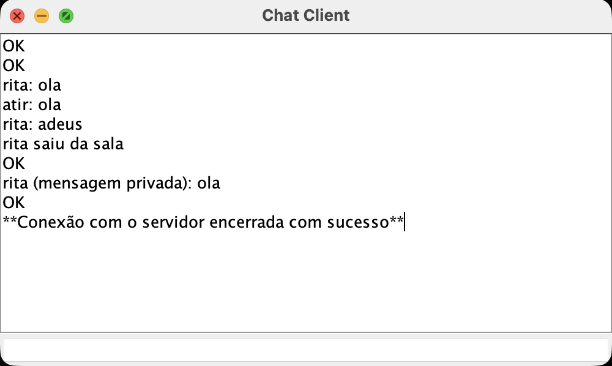

# Java Chat Server/Client 

## Overview


This repository consists of a chat server, made in Java, and communication between clients in various rooms. The server is based on the multiplex model, and the client uses two threads, so he can receive messages from the server while waiting for another user to write a new message or command.

## Directory Tree
```
|---ChatServer.java
|---ChatClient.java
|---classes...
|---README.md
```

## Run
To run the chat server, use this command on the terminal line: `java ChatServer 8000`.
To run each client, use the following command on the terminal line: `java ChatClient localhost 8000`.

## Client commands
The client must communicate with the server to make certain configurations, such as:
- /nick {nickname} : Used to create or change the user's nickname. It's an obbligation to have one. 
- /join {room} : Used to enter a room, even if the user is already in one. In that case, the server removes the user from one room and puts him in the wanted room;
- /priv {name} {msg} : Used to send private messages to a specific user, even if they aren't in the same room;
- /leave : Used to leave a room;
- /bye : Used to leave the chat server.

## Server responses
The server responds to the client commands, and those messages might go to the client or to other clients:
- OK : Sent if the command was successful;
- ERROR : Sent if the command wan't successful;
- MESSAGE {name} {msg} : Broadcasts the message a client sent in a room to the other clients inside it. If the client is alone or not in a room, no response is sent;
- PRIVATE {name} {msg} : Sent to a specific user, from the client who sent it ({name}), as a private message that only he sees;
- NEWNICK {old_nickname} {new_nickname} : Broadcasted to users in a room when the user changes its nickname, except the actual user;
- JOINED {name} : Broadcasted when a user enters a room, to the other users inside that room, except the actual user;
- LEFT {name} : Broadcasted when a user leaves a room, to the other users inside that room, except the actual user;
- BYE : Sent to the user, to confirm that he wants to leave the server.

## Example prints
The example above shows a conversation between user rita and user atir.

Here's the flow of this side of the chat:
- /nick rita -> OK
- /join sala1 -> OK
- ola -> rita: ola
- adeus -> rita: adeus
- /leave -> OK
- /priv rita ola -> OK
- /bye -> **Conexão com o servidor encerrada com sucesso**

Here's the flow of this side of the chat:
- /nick atir -> OK
- /join sala1 -> OK
- ola -> atir: ola
- /leave -> OK
- /priv atir ola -> OK
- /bye -> **Conexão com o servidor encerrada com sucesso**


## Authorship
Made by Maximiliano Sá and Rita Moreira.

Built as part of coursework at [Faculdade de Ciências da Universidade do Porto](https://www.up.pt/fcup/pt/).
